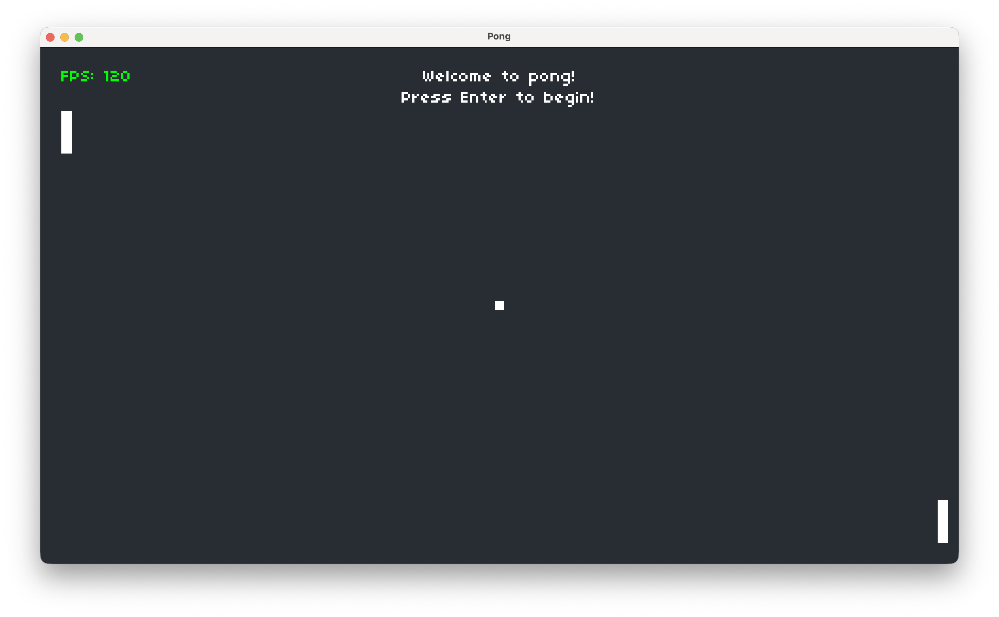

# Pong
Pong is a classic, fast-paced, arcade game where two players control paddles and compete to keep the ball in play. A player scores when their opponent fails to return the ball. The first player to reach a score of 10 wins.

---

## 🎮 Features

- Two-player local gameplay
- Smooth paddle movement
- Ball physics with collision detection
- Score tracking system
- Win condition at 10 points

---

## 🎮 Controls

- **Enter** or **Return** → Start and Pause / Unpause 
- **Esc** → Exit 

### Left Player
- **W** → Move up  
- **S** → Move down  

### Right Player
- **↑ Arrow** → Move up  
- **↓ Arrow** → Move down  

---

## ▶️ How to Run

1. Install [LÖVE2D](https://love2d.org/)
2. Clone this repository:
	```bash
	git clone https://github.com/your-username/pong.git pong
	```
3. Navigate to the folder:
	```bash
	cd pong
	```
4. Run the game:
	```bash
	love .
	```
## 🎮 Gameplay



## 👤 Author

*Developed by Nour Dahouk*

## 🛠️ Built With

- LÖVE2D (Lua)